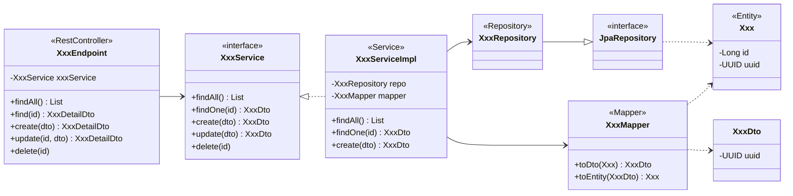
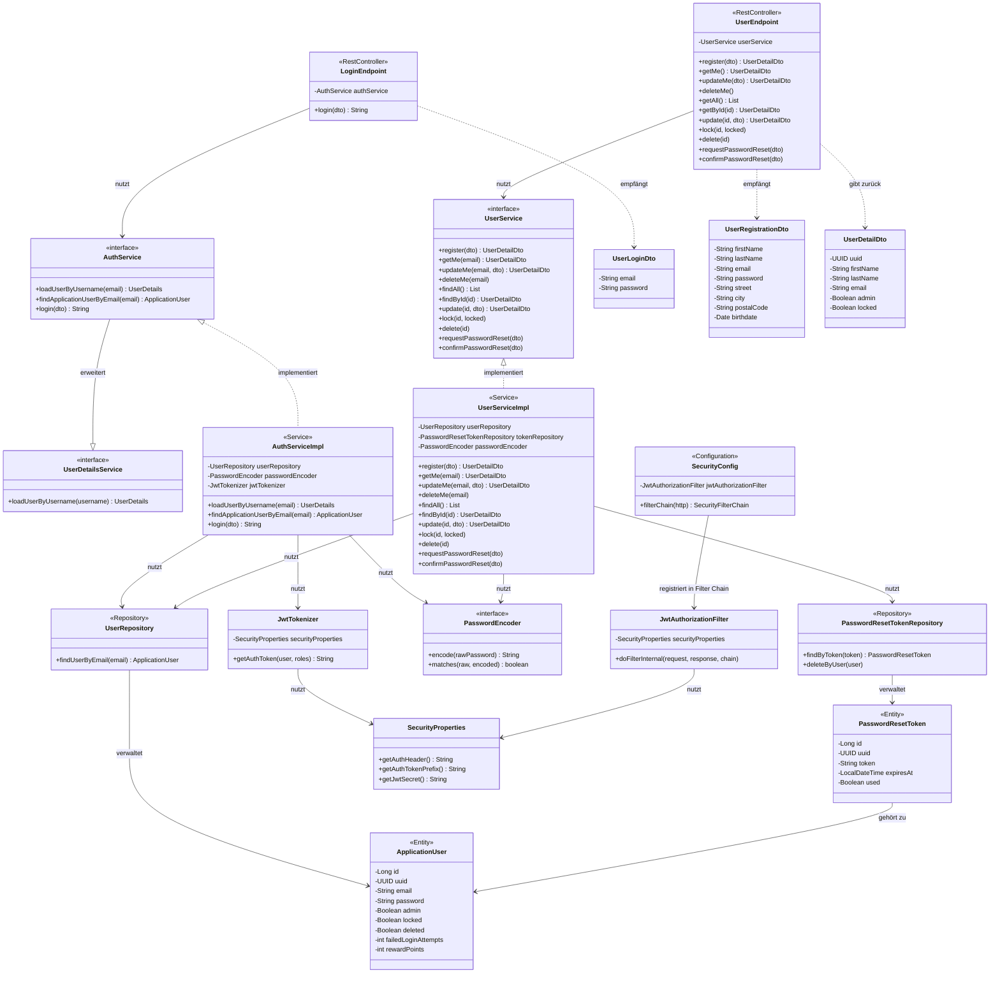

# 5.11 Designdokument – Ticketline 4.0

---

## 1. Modellierung der Kernstrukturen der Applikation

### 1.1 Wiederkehrendes Schichtenmuster

Jedes fachliche Modul in Ticketline 4.0 folgt demselben architektonischen Aufbau. Das Muster besteht aus fünf aufeinanderfolgenden Klassen/Interfaces, die sich von der REST-Schnittstelle bis zur Datenbank erstrecken:

```
Endpoint (Controller) → Service Interface → Service Implementierung → Repository → Entity
```

Das Spring Framework übernimmt dabei die Verdrahtung aller Komponenten automatisch über **Dependency Injection** (Constructor Injection).

### 1.2 Allgemeines Schichtenmuster (Anwendung auf alle Module)

Das folgende Diagramm zeigt das **generische Muster**, das für jedes neue fachliche Modul (z.B. Event, Ticket, Venue) identisch angewendet wird:



> **Konvention:** Alle neuen Module folgen diesem Muster. `Xxx` wird durch den fachlichen Namen ersetzt (z.B. `Event`, `Ticket`, `Venue`, `Artist`). Service-Interfaces befinden sich in `service/`, Implementierungen in `service/impl/`, Endpoints in `endpoint/`, DTOs in `endpoint/dto/`, Mapper in `service/mapper/`. Der Service-Layer arbeitet ausschließlich mit DTOs — Entities sind ein internes Implementierungsdetail der Service-Schicht.

---

### 1.3 Klassendiagramm – User & Authentifizierung




### 1.4 Integration des Spring Frameworks

Das Spring Framework übernimmt die Infrastruktur, sodass sich Entwickler auf die fachliche Logik konzentrieren können. Die folgende Tabelle zeigt, welche Spring-Mechanismen wo eingesetzt werden:

| Spring-Mechanismus | Annotation | Wirkung |
|--------------------|------------|---------|
| **Dependency Injection** | `@Service`, `@Repository`, `@RestController`, `@Component` | Spring instanziiert und verdrahtet Beans automatisch |
| **Constructor Injection** | – (via Konstruktor) | Explizite, testbare Abhängigkeiten; kein `@Autowired` auf Feldern |
| **Transaction Management** | `@Transactional` | Spring öffnet/schließt DB-Transaktionen automatisch |
| **Security Filter Chain** | `@EnableWebSecurity` | JWT-Filter wird in Spring Security Pipeline eingehängt |
| **Method Security** | `@Secured("ROLE_X")` | Rollenprüfung vor Methodenaufruf |
| **Request Mapping** | `@RestController`, `@GetMapping`, etc. | URL-zu-Methode-Mapping |
| **Validation** | `@Valid`, `@NotNull`, `@Size` | Automatische Eingabevalidierung vor Methodenaufruf |
| **Exception Handling** | `@ControllerAdvice` | Zentrales Mapping von Exceptions auf HTTP-Statuscodes |
| **DTO-Mapping** | `@Mapper` (MapStruct) | Compile-Zeit-Generierung von Mapping-Code, kein Reflection |
| **Profile-Steuerung** | `@Profile("generateData")` | Testdaten nur bei aktivem Profil erzeugt |
| **ORM** | `@Entity`, `@Column`, `@Id` | Automatisches Mapping zwischen Java-Objekt und DB-Tabelle |


## 2. Eingesetzte Patterns

Die folgenden Entwurfsmuster werden systematisch in allen Modulen von Ticketline 4.0 eingesetzt:

### 2.1 Repository Pattern

Das Repository Pattern kapselt den gesamten Datenbankzugriff hinter einem Interface. Jedes fachliche Modul besitzt ein eigenes Repository-Interface, das `JpaRepository<Entity, ID>` erweitert. Die konkrete Implementierung wird von Spring Data JPA automatisch zur Laufzeit generiert.

**Einsatz:** `MessageRepository extends JpaRepository<Message, Long>` mit der benutzerdefinierten Methode `findAllByOrderByPublishedAtDesc()`. Alle weiteren Module (Event, Ticket, User) folgen demselben Muster.

**Vorteil:** CRUD-Operationen werden ohne eigene Implementierung bereitgestellt; komplexe Abfragen werden via JPQL (`@Query`) ergänzt.

### 2.2 Service Layer Pattern (Interface + Implementierung)

Jedes Modul trennt die Serviceschicht in ein Interface (Vertrag) und eine Implementierungsklasse (Logik). Das Interface befindet sich in `service/`, die Implementierung in `service/impl/`.

**Einsatz:**
- `MessageService` (Interface) → `SimpleMessageService` (`@Service`)
- `UserService` (Interface, erweitert `UserDetailsService`) → `CustomUserDetailService` (`@Service`)

**Vorteil:** Services können im Test durch Mocks ersetzt werden (Mockito). Die Implementierung kann ausgetauscht werden, ohne den Aufrufer zu ändern.

### 2.3 Builder Pattern

Alle Entities und DTOs verwenden einen manuell implementierten **Inner-Class-Builder** für die Objektkonstruktion. Der Builder wird über eine statische Factory-Methode zugänglich gemacht.

**Einsatz:**
```java
Message message = Message.aMessage()
    .withTitle("Titel")
    .withSummary("Zusammenfassung")
    .withText("Volltext")
    .withPublishedAt(LocalDateTime.now())
    .build();
```

Gleiches Muster bei: `SimpleMessageDto.aSimpleMessageDto()`, `DetailedMessageDto.aDetailedMessageDto()`, `MessageInquiryDto.aMessageInquiryDto()`, `UserLoginDto.anUserLoginDto()`.

**Vorteil:** Lesbarer als Konstruktoren mit vielen Parametern; erzwingt explizite Feldzuweisung.

### 2.4 DTO Pattern (Data Transfer Object)

DTOs trennen die interne Datenbankrepräsentation (Entity) von der externen API-Repräsentation. Entities werden nie direkt an den Client gesendet. 

**Vorteil:** Verhindert *Entity-Leakage* (ungewollte Ausgabe interner Felder wie Passwort-Hashes oder DB-Metadaten).

### 2.5 Mapper Pattern (MapStruct)

MapStruct generiert zur **Compile-Zeit** typsicheren Mapping-Code zwischen Entities und DTOs. Es wird kein Reflection zur Laufzeit benötigt.

**Einsatz:** `MessageMapper` mit `@Mapper`-Annotation:
- `messageToSimpleMessageDto(Message)` → `SimpleMessageDto`
- `messageToDetailedMessageDto(Message)` → `DetailedMessageDto`
- `messageInquiryDtoToMessage(MessageInquiryDto)` → `Message`

**Vorteil:** Fehler im Mapping werden zur Compile-Zeit erkannt, nicht erst zur Laufzeit.

### 2.6 Filter / Chain of Responsibility Pattern

Spring Security implementiert eine **Filter Chain**, in die eigene Filter eingehängt werden können. Der `JwtAuthorizationFilter` prüft bei jedem eingehenden HTTP-Request den JWT-Token, bevor der Request den Controller erreicht.

**Einsatz:** `JwtAuthorizationFilter` liest den `Authorization`-Header aus, validiert die JWT-Signatur anhand von `SecurityProperties.getJwtSecret()` und setzt den Sicherheitskontext (`SecurityContextHolder`). Die Konfiguration erfolgt in `SecurityConfig` (`@Configuration`).

**Vorteil:** Authentifizierungsprüfung ist zentral und modular – kein Endpoint muss selbst Token-Validierung implementieren.

### 2.7 Global Exception Handler Pattern

Ein zentraler `GlobalExceptionHandler` mit `@ControllerAdvice` fängt alle applikationsspezifischen Exceptions ab und wandelt sie einheitlich in HTTP-Fehlerantworten um.

**Einsatz:**

| Exception | HTTP-Status | Verhalten |
|-----------|------------|-----------|
| `NotFoundException` | 404 Not Found | Exception-Nachricht als Response-Body |
| `MethodArgumentNotValidException` | 400 Bad Request | Validierungsfehler als Map |

**Vorteil:** Kein Endpoint muss Exception-Handling selbst implementieren; alle Fehlerantworten folgen einem einheitlichen Format.

### 2.8 Internal/External ID Pattern

Um die interne Datenbankstruktur zu kapseln und die Sicherheit zu erhöhen (Security by Obscurity), wird strikt zwischen internen und externen Identifikatoren unterschieden:

*   **Internal ID (`Long id`):** Ein technischer Primärschlüssel (Auto-Increment), der ausschließlich innerhalb der Persistenzschicht und für Datenbank-Joins verwendet wird. Diese ID wird niemals über die REST-Schnittstelle nach außen gegeben.
*   **External ID (`UUID uuid`):** Ein fachlich-technischer, zufällig generierter Identifikator, der in DTOs verwendet wird. Alle öffentlichen API-Endpoints (z.B. `GET /api/v1/messages/{uuid}`) nutzen ausschließlich diese UUID zur Identifikation von Ressourcen.

**Vorteil:**
1.  Verhindert *ID Enumeration Attacks* (Angreifer können IDs nicht einfach hochzählen).
2.  Entkoppelt die öffentliche API von der internen Datenbank-Logik.

---

## 3. Domänenmodell

Das Domänenmodell beschreibt die fachlichen Klassen und ihre Beziehungen. Technische Klassen (Repositories, Services, DTOs, Mapper) sind nicht enthalten.

Das folgende Diagramm zeigt das **geplante Ziel-Domänenmodell** für Ticketline 4.0 mit allen Entities, die im Laufe der Implementierung entstehen werden:

[Hier geht es zum Domänenmodell](Domainmodell.md)

## Design-Entscheidungen

### Account-Löschung (Soft Delete)
Beim "unwiderruflichen Löschen" (User Story 2.1.4) wird kein Hard Delete auf `ApplicationUser` durchgeführt, da Rechnungen und Orders aus rechtlichen Gründen erhalten bleiben müssen. Stattdessen werden alle personenbezogenen Felder (Name, Adresse, E-Mail, Passwort) anonymisiert und `deleted = true` gesetzt. Der Account bleibt als Datensatz in der DB, ist aber nicht mehr nutzbar.

- `locked = true` → Account gesperrt (nach 5 Fehlversuchen oder admin-seitig) – temporär, rückgängig machbar
- `deleted = true` → Account auf Kundenwunsch anonymisiert – permanent, Login nicht mehr möglich

### Rechnungs-Snapshot
`Invoice` speichert Name und Adresse des Kunden zum Kaufzeitpunkt in eigenen Feldern (`customerFirstName`, `customerLastName`, `customerStreet` etc.). Damit ist die Rechnung ein eigenständiges, unveränderliches Dokument – unabhängig davon, ob der User später seine Adresse ändert oder seinen Account löscht. Erforderlich für die österreichische Aufbewahrungspflicht (7 Jahre) und DSGVO-Konformität.

### Order-Multiplizität (0..1)
`OrderItem`s (insbesondere `Ticket`s) können ohne zugehörige `Order` existieren, solange sie den Status `RESERVED` haben. Eine `Order` entsteht erst beim tatsächlichen Kauf. Die Multiplizität `Order "0..1" --> "n" OrderItem` bildet diesen Lebenszyklus korrekt ab.

### ReservationStatus
`Reservation` trägt einen eigenen Status (`ACTIVE`, `PARTIALLY_PURCHASED`, `PURCHASED`, `CANCELLED`, `EXPIRED`), damit der Zustand einer Reservierung direkt ablesbar ist – ohne alle zugehörigen Tickets einzeln prüfen zu müssen. Übergänge: `ACTIVE` → `PARTIALLY_PURCHASED` / `PURCHASED` / `CANCELLED` / `EXPIRED`.


> **Hinweis:** `ApplicationUser` und `Message` sind bereits im Template vorhanden. Alle weiteren Entities werden im Laufe der Implementierung ergänzt.

---

## 4. Exception-Handling

### 4.1 Exception-Konzept

Ticketline 4.0 verwendet ausschließlich **Runtime Exceptions** (unkontrollierte Ausnahmen). Checked Exceptions werden in Service- und Repository-Schichten nicht eingesetzt, weil:

- **Spring `@Transactional`** löst einen Rollback standardmäßig nur bei `RuntimeException` aus – nicht bei Checked Exceptions.
- **Automatische Propagation:** Runtime Exceptions wandern automatisch durch alle Schichten bis zum `GlobalExceptionHandler`, ohne dass jede Methode die Exception explizit deklarieren oder weiterreichen muss (`throws XyzException`).
- **Zentrales Handling:** Da der `@ControllerAdvice` alle Exceptions zentral abfängt, gibt es keinen Grund, Exceptions checked zu machen – das Problem wird einmal zentral behandelt, nicht an jeder Stelle im Code.
- **Konsistenz mit Spring/Hibernate:** Spring Data und Hibernate werfen selbst ausschließlich `RuntimeException`-Unterklassen (`DataAccessException` etc.). Das Template folgt diesem etablierten Stil.


### 4.2 Geplante Exception-Klassen

| Exception-Klasse | HTTP-Status | Anwendungsfall |
|-----------------|------------|----------------|
| `NotFoundException` | 404 Not Found | Ressource nicht gefunden |
| `ValidationException` | 422 Unprocessable Entity | Fachliche Validierungsfehler (z.B. Datum in der Vergangenheit) |
| `ConflictException` | 409 Conflict | Doppelte Buchung, bereits gesperrter Account |
| `AuthorizationException` | 403 Forbidden | Zugriff auf fremde Ressourcen |
| `AccountLockedException` | 423 Locked | Login-Versuch auf gesperrtem Account (nach 5 Fehlversuchen) |
| `ValidationException` | 422 Unprocessable Entity | im Fall eines Validierungs fehlers |
| `BadRequestException` | 400 Bad Request | Syntax Fehler (z.B der Server kann den body nicht verarbeiten) |


### 4.3 GlobalExceptionHandler

Der `GlobalExceptionHandler` (`endpoint/exceptionhandler/GlobalExceptionHandler.java`) trägt die Annotation `@ControllerAdvice` und fängt alle applikationsspezifischen Exceptions zentral ab. 

### 4.4 Fehlerantwortformat
```json
{
  "status": 422,
  "message": "Validation failed",
  "fieldErrors": [
    {
      "field": "email",
      "message": "must be a valid email address"
    }
  ]
}
```


---

## 5. REST Spezifikation

### 5.1 Allgemeines

Die REST-API von Ticketline 4.0 folgt den Konventionen von HTTP/JSON:

| Eigenschaft | Wert |
|------------|------|
| Basis-URL (Entwicklung) | `http://localhost:8080/api/v1/` |
| Format | JSON (`Content-Type: application/json`) |
| Authentifizierung | JWT Bearer Token (`Authorization: Bearer <token>`) |
| API-Dokumentation | Swagger UI: `http://localhost:8080/swagger-ui/index.html` |

Die vollständige, interaktive API-Dokumentation mit allen Request/Response-Schemas wird automatisch von **OpenAPI 3.0 / Swagger UI** generiert. Endpunkte können direkt über die Swagger-Oberfläche getestet werden (nach Eintrag des JWT-Tokens über den „Authorize"-Button).

### 5.2 Geplante Endpoints (Übersicht)

| Modul | HTTP-Methode | Pfad | Erforderliche Rolle |
|-------|-------------|------|---------------------|
| **Authentifizierung** | POST | `/api/v1/authentication` | PermitAll |
| **Registrierung** | POST | `/api/v1/users/register` | PermitAll |
| **Passwort-Reset** | POST | `/api/v1/users/reset-password` | PermitAll |
| **Passwort-Reset** | POST | `/api/v1/users/reset-password/confirm` | PermitAll |
| **Eigenes Profil** | GET | `/api/v1/users/me` | USER |
| **Eigenes Profil** | PUT | `/api/v1/users/me` | USER |
| **Benutzerverwaltung** | GET | `/api/v1/users` | ADMIN |
| **Benutzerverwaltung** | GET | `/api/v1/users/{id}` | ADMIN |
| **Benutzerverwaltung** | PUT | `/api/v1/users/{id}` | ADMIN |
| **Benutzerverwaltung** | PATCH | `/api/v1/users/{id}/lock` | ADMIN |
| **Benutzerverwaltung** | DELETE | `/api/v1/users/{id}` | ADMIN |
| **News** | GET | `/api/v1/messages` | USER |
| **News** | GET | `/api/v1/messages/{id}` | USER |
| **News** | POST | `/api/v1/messages` | ADMIN |
| **Veranstaltungen** | GET | `/api/v1/events` | USER |
| **Veranstaltungen** | GET | `/api/v1/events/{id}` | USER |
| **Veranstaltungen** | GET | `/api/v1/events/top10` | USER |
| **Veranstaltungen** | POST | `/api/v1/events` | ADMIN |
| **Künstler** | GET | `/api/v1/artists` | USER |
| **Künstler** | POST | `/api/v1/artists` | ADMIN |
| **Merchandise** | GET  | `/api/v1/merchandise`        | USER  |
| **Merchandise** | POST | `/api/v1/merchandise`        | ADMIN |
| **Merchandise** | POST | `/api/v1/merchandise/orders` | USER  |
| **Prämien**     | GET  | `/api/v1/rewards`            | USER  |
| **Prämien**     | POST | `/api/v1/rewards/redeem`     | USER  |
| **Prämien**     | GET  | `/api/v1/users/me/rewards`   | USER  |
| **Tickets** | POST | `/api/v1/tickets/reserve` | USER |
| **Tickets** | POST | `/api/v1/tickets/purchase` | USER |
| **Tickets** | DELETE | `/api/v1/tickets/{id}` | USER |
| **Rechnungen** | GET | `/api/v1/invoices/{id}` | USER |

### 5.3 Bildupload – Multipart/Form-Data

Endpoints, die Bilder empfangen (z. B. `POST /api/v1/messages`), verwenden `multipart/form-data` statt `application/json`. Der Request besteht aus zwei Parts:

| Part | Content-Type | Beschreibung |
|---|---|---|
| `dto` | `application/json` | Metadaten (Titel, Zusammenfassung, Text) |
| `images` | `image/jpeg`, `image/png` | Mindestens ein Bild (1..*); mehrere Bilder als wiederholter Part |

Der Endpoint nimmt die Parts über `@RequestPart` entgegen:

```java
@PostMapping(consumes = MediaType.MULTIPART_FORM_DATA_VALUE)
public DetailedMessageDto create(
    @RequestPart("dto") @Valid MessageInquiryDto dto,
    @RequestPart("images") List<MultipartFile> images
) { ... }
```

Die Bilder werden serverseitig auf erlaubte MIME-Types (`image/jpeg`, `image/png`) und Mindestanzahl (≥ 1) geprüft. Die Binärdaten werden in der Datenbank als `@Lob byte[]` in der `MessageImage`-Entity gespeichert und über einen separaten GET-Endpoint (`GET /api/v1/messages/{id}/images/{imageId}`) ausgeliefert. Das Frontend setzt `Content-Type: multipart/form-data` automatisch über die `FormData`-API; der `Authorization: Bearer <token>`-Header bleibt unverändert.

> Die genauen Request- und Response-Schemas sind in der Swagger UI einzusehen. HTTP-Statuscodes folgen dem Standard: 200 OK, 201 Created, 204 No Content, 400 Bad Request, 401 Unauthorized, 403 Forbidden, 404 Not Found, 409 Conflict.

---

## 6. Logging

### 6.1 Framework

Ticketline 4.0 verwendet **SLF4J** als Logging-Abstraktion mit **Logback** als Implementierung (via `spring-boot-starter-logging`). Logger werden als statisches Feld in jeder Klasse deklariert:

```java
private static final Logger log = LoggerFactory.getLogger(SimpleMessageService.class);
```

### 6.2 Log-Level-Strategie

| Level | Einsatzbereich | Beispiel |
|-------|---------------|---------|
| `DEBUG` | Detaillierte Ablaufverfolgung, nur in Entwicklung aktiv | Methodenaufruf mit Parametern, Zwischenergebnisse |
| `INFO` | Normale Operationen, fachliche Ereignisse | Neue News veröffentlicht, Ticket gebucht, Benutzer eingeloggt |
| `WARN` | Erwartete Fehlerzustände, die behandelt werden | Benutzer nicht gefunden, fehlgeschlagener Login-Versuch |
| `ERROR` | Unerwartete Systemfehler | Datenbankverbindung unterbrochen, unbehandelte Exception |

### 6.3 Logging-Konventionen

- **Service-Schicht:** Primärer Ort für fachliches Logging (`INFO`/`WARN`)
- **Endpoint-Schicht:** Kein Logging (Spring MVC loggt HTTP-Requests bereits)
- **Repository-Schicht:** Kein manuelles Logging (Hibernate kann SQL-Queries via `DEBUG` ausgeben)
- Keine sensiblen Daten (Passwörter, Tokens) werden geloggt

### 6.4 Konfiguration

Log-Level werden in `application.yml` konfiguriert:

```yaml
logging:
  level:
    at.ac.tuwien.sepr.groupphase: INFO
    org.springframework.security: WARN
    org.hibernate.SQL: DEBUG   # nur in Entwicklung
```

---

## 7. Sicherheitsarchitektur

### 7.1 Authentifizierung (JWT)

Die Authentifizierung erfolgt zustandslos über **JSON Web Tokens (JWT)**:

1. Der Client sendet `POST /api/v1/authentication` mit E-Mail und Passwort
2. `AuthServiceImpl.loadUserByUsername()` lädt den User aus der DB — wirft `LockedException` wenn `locked = true`, `DisabledException` wenn `deleted = true`
3. `AuthServiceImpl.login()` verifiziert das Passwort via BCrypt
4. Bei **falschem Passwort**: `failedLoginAttempts` wird inkrementiert; ab 5 Fehlversuchen wird `locked = true` gesetzt → 401-Fehler
5. Bei **richtigem Passwort**: `failedLoginAttempts` wird auf 0 zurückgesetzt; `JwtTokenizer.getAuthToken()` gibt signierten JWT zurück
6. Der Client sendet den Token bei jedem Folge-Request im Header: `Authorization: Bearer <token>`
7. `JwtAuthorizationFilter` validiert die Signatur und setzt den Spring Security Context

**Token-Gültigkeit:** 12 Stunden

> **Hinweis:** Da JWTs zustandslos sind, bleibt ein bereits ausgestellter Token bis zu seinem Ablauf gültig — auch wenn der Account danach gesperrt wird. Die kurze Gültigkeit (12 h) begrenzt dieses Fenster.

### 7.2 Autorisierung (Role-Based Access Control)

Ticketline 4.0 implementiert zwei Rollen:

| Rolle | Berechtigung |
|-------|-------------|
| `ROLE_USER` | Normale Kunden: Veranstaltungen suchen, Tickets kaufen/reservieren, News lesen |
| `ROLE_ADMIN` | Administratoren: Alle USER-Berechtigungen + Benutzer verwalten, News erstellen, Veranstaltungen anlegen |

Die Rollenprüfung erfolgt deklarativ via `@Secured("ROLE_X")` auf Endpoint-Methoden.

### 7.3 Sicherheitsmaßnahmen im Überblick

| Risiko | Maßnahme | Implementierung |
|--------|---------|----------------|
| Unauthentifizierter Zugriff | JWT-Validierung auf allen geschützten Endpoints | `JwtAuthorizationFilter` |
| Unberechtigter Zugriff | Rollenbasierte Zugriffskontrolle | `@Secured("ROLE_X")` |
| Klartext-Passwörter | BCrypt-Hashing | `PasswordEncoder` (Spring Security) |
| SQL-Injection | JPA/JPQL mit Parameter-Binding | Kein String-Concatenation in Queries |
| Brute-Force / Credential Stuffing | Account-Sperre nach 5 Fehlversuchen | `ApplicationUser.failedLoginAttempts` (User Story 2.1.2) |
| Token-Fälschung | HMAC-signierte JWTs | `JwtTokenizer` mit `SecurityProperties.getJwtSecret()` |

### 7.4 Spring Security Konfiguration

Die Security-Konfiguration ist in `SecurityConfig` (`@Configuration`, `@EnableWebSecurity`) zentralisiert:
- `JwtAuthorizationFilter` wird in die Spring Security Filter Chain eingehängt
- Öffentliche Endpunkte (`/api/v1/authentication`, `/api/v1/users/register`, `/api/v1/users/reset-password/**`) werden via `permitAll()` freigeschaltet
- Alle anderen Endpunkte erfordern eine gültige Authentifizierung

---

### 7.5 Account-Lifecycle

#### Selbstregistrierung

1. Client sendet `POST /api/v1/users/register` mit `UserRegistrationDto` (Name, E-Mail, Passwort, Adresse, Geburtsdatum)
2. Service prüft: E-Mail bereits vergeben? → `ConflictException` (409)
3. Passwort wird via `PasswordEncoder.encode()` gehasht und nie im Klartext gespeichert
4. `ApplicationUser` wird mit `admin = false`, `locked = false`, `deleted = false`, `failedLoginAttempts = 0` angelegt
5. Antwort: `UserDetailDto` (201 Created) — kein Passwort-Hash in der Antwort

#### Account-Sperre (automatisch + manuell)

| Auslöser | Aktion | Rückgängig |
|---------|--------|-----------|
| 5 aufeinanderfolgende Fehlversuche beim Login | `locked = true`, `failedLoginAttempts = 5` | Ja — Admin setzt `locked = false` via `PATCH /api/v1/users/{id}/lock` |
| Admin-seitige Sperre | `locked = true` | Ja — Admin setzt `locked = false` |
| Erfolgreicher Login | `failedLoginAttempts = 0` | — |

`loadUserByUsername()` prüft `locked` und gibt `UserDetails.isAccountNonLocked() = false` zurück, wenn gesperrt → Spring Security wirft `LockedException` → GlobalExceptionHandler mappt auf 401.

#### Account-Löschung (Soft Delete)

1. Admin sendet `DELETE /api/v1/users/{id}`
2. Service anonymisiert alle personenbezogenen Felder (Name, E-Mail, Passwort, Adresse) und setzt `deleted = true`
3. Kein Hard Delete — Orders, Reservierungen und Rechnungen bleiben erhalten (gesetzliche Aufbewahrungspflicht)
4. Bei nächstem Login: `loadUserByUsername()` gibt `UserDetails.isEnabled() = false` zurück → `DisabledException` → 401

#### Passwort-Reset-Flow

1. Client sendet `POST /api/v1/users/reset-password` mit `PasswordResetRequestDto` (E-Mail)
2. Service sucht User anhand E-Mail — **gibt immer 200 zurück**, unabhängig ob E-Mail existiert (verhindert User-Enumeration)
3. Falls User existiert: `PasswordResetToken` wird generiert (UUID), gehasht gespeichert, Ablauf = 1 Stunde; Token wird per E-Mail versendet
4. Client sendet `POST /api/v1/users/reset-password/confirm` mit `PasswordResetConfirmDto` (Token + neues Passwort)
5. Service prüft: Token vorhanden, nicht abgelaufen (`expiresAt > now`), nicht bereits verwendet (`used = false`)
6. Neues Passwort wird gehasht und gesetzt; `PasswordResetToken.used = true`; `failedLoginAttempts = 0`