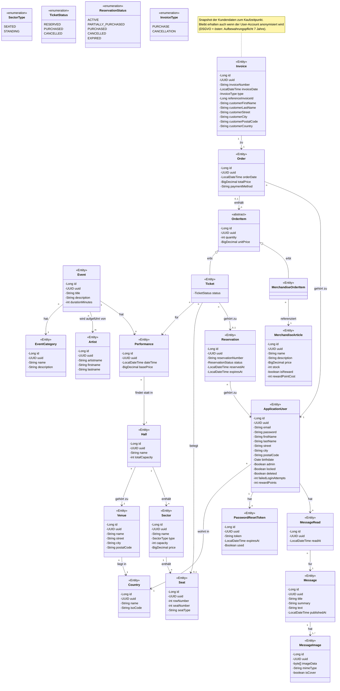

```mermaid
    classDiagram
        direction TB

        class ApplicationUser {
            <<Entity>>
            -Long id
            -UUID uuid
            -String email
            -String password
            -String firstName
            -String lastName
            -String street
            -String city
            -String postalCode
            -Date birthdate
            -Boolean admin
            -Boolean locked
            -Boolean deleted
            -int failedLoginAttempts
            -int rewardPoints
        }

        class PasswordResetToken {
            <<Entity>>
            -Long id
            -UUID uuid
            -String token
            -LocalDateTime expiresAt
            -Boolean used
        }

        class Message {
            <<Entity>>
            -Long id
            -UUID uuid
            -String title
            -String summary
            -String text
            -LocalDateTime publishedAt
        }

        class MessageImage {
            <<Entity>>
            -Long id
            -UUID uuid
            -byte[] imageData
            -String mimeType
            -boolean isCover
        }

        class MessageRead {
            <<Entity>>
            -Long id
            -UUID uuid
            -LocalDateTime readAt
        }

        class Artist {
            <<Entity>>
            -Long id
            -UUID uuid
            -String artistname
            -String firstname
            -String lastname
        }

        class EventCategory {
            <<Entity>>
            -Long id
            -UUID uuid
            -String name
            -String description
        }

        class Event {
            <<Entity>>
            -Long id
            -UUID uuid
            -String title
            -String description
            -int durationMinutes
        }

        class Performance {
            <<Entity>>
            -Long id
            -UUID uuid
            -LocalDateTime dateTime
            -BigDecimal basePrice
        }

        class Country {
            <<Entity>>
            -Long id
            -UUID uuid
            -String name
            -String isoCode
        }

        class Venue {
            <<Entity>>
            -Long id
            -UUID uuid
            -String name
            -String street
            -String city
            -String postalCode
        }

        class Hall {
            <<Entity>>
            -Long id
            -UUID uuid
            -String name
            -int totalCapacity
        }

        class SectorType {
            <<enumeration>>
            SEATED
            STANDING
        }

        class TicketStatus {
            <<enumeration>>
            RESERVED
            PURCHASED
            CANCELLED
        }

        class ReservationStatus {
            <<enumeration>>
            ACTIVE
            PARTIALLY_PURCHASED
            PURCHASED
            CANCELLED
            EXPIRED
        }

        class InvoiceType {
            <<enumeration>>
            PURCHASE
            CANCELLATION
        }

        class Sector {
            <<Entity>>
            -Long id
            -UUID uuid
            -String name
            -SectorType type
            -int capacity
            -BigDecimal price
        }

        class Seat {
            <<Entity>>
            -Long id
            -UUID uuid
            -int rowNumber
            -int seatNumber
            -String seatType
        }

        class OrderItem {
            <<abstract>>
            -Long id
            -UUID uuid
            -int quantity
            -BigDecimal unitPrice
        }

        class Ticket {
            <<Entity>>
            -TicketStatus status
        }

        class MerchandiseOrderItem {
            <<Entity>>
        }

        class Reservation {
            <<Entity>>
            -Long id
            -UUID uuid
            -String reservationNumber
            -ReservationStatus status
            -LocalDateTime reservedAt
            -LocalDateTime expiresAt
        }

        class Order {
            <<Entity>>
            -Long id
            -UUID uuid
            -LocalDateTime orderDate
            -BigDecimal totalPrice
            -String paymentMethod
        }

        class Invoice {
            <<Entity>>
            -Long id
            -UUID uuid
            -String invoiceNumber
            -LocalDateTime invoiceDate
            -InvoiceType type
            -Long referenceInvoiceId
            -String customerFirstName
            -String customerLastName
            -String customerStreet
            -String customerCity
            -String customerPostalCode
            -String customerCountry
        }
        note for Invoice "Snapshot der Kundendaten zum Kaufzeitpunkt.
        Bleibt erhalten auch wenn der User-Account anonymisiert wird
        (DSGVO + österr. Aufbewahrungspflicht 7 Jahre)."

        class MerchandiseArticle {
            <<Entity>>
            -Long id
            -UUID uuid
            -String name
            -String description
            -BigDecimal price
            -int stock
            -boolean isReward
            -int rewardPointCost
        }

        ApplicationUser "n" --> "1" Country : wohnt in
        Venue "n" --> "1" Country : liegt in
        ApplicationUser "1" --> "n" PasswordResetToken : hat
        ApplicationUser "1" --> "n" MessageRead : hat
        MessageRead "n" --> "1" Message : für
        Message "1" --> "1..*" MessageImage : hat
        Event "n" --> "1" EventCategory : hat
        Event "n" --> "m" Artist : wird aufgeführt von
        Event "1" --> "n" Performance : hat
        Performance "n" --> "1" Hall : findet statt in
        Hall "n" --> "1" Venue : gehört zu
        Hall "1" --> "n" Sector : enthält
        Sector "1" --> "n" Seat : enthält
        OrderItem <|-- Ticket : erbt
        OrderItem <|-- MerchandiseOrderItem : erbt
        Order "0..1" --> "n" OrderItem : enthält
        Order "n" --> "1" ApplicationUser : gehört zu
        Ticket "n" --> "1" Performance : für
        Ticket "n" --> "0..1" Seat : belegt
        Ticket "n" --> "0..1" Reservation : gehört zu
        Reservation "n" --> "1" ApplicationUser : gehört zu
        MerchandiseOrderItem "n" --> "1" MerchandiseArticle : referenziert
        Invoice "1" --> "1" Order : zu
```