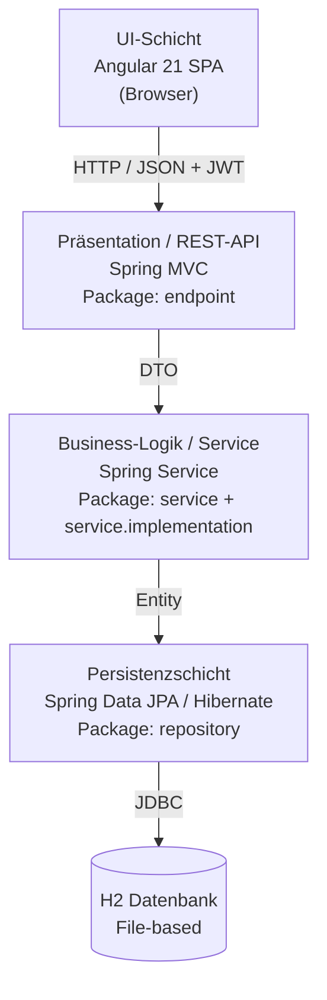
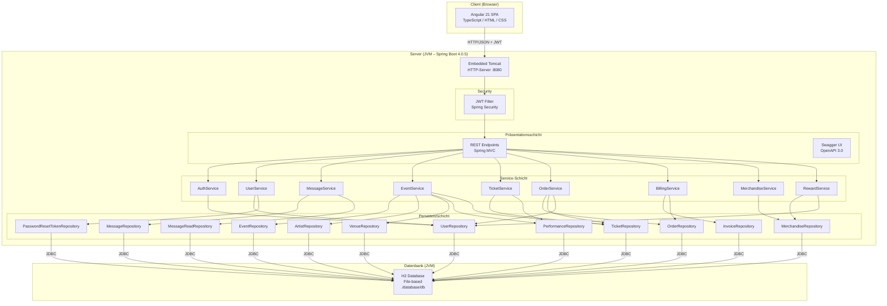
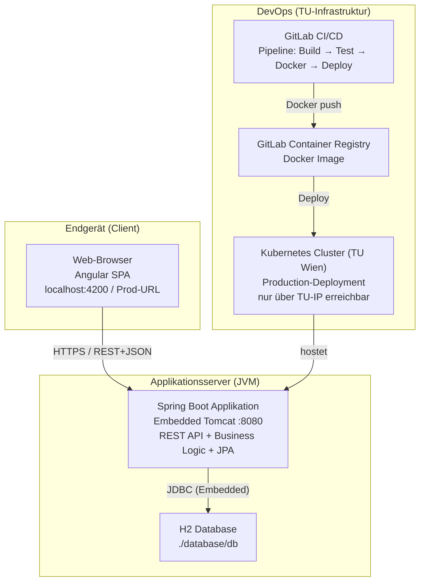
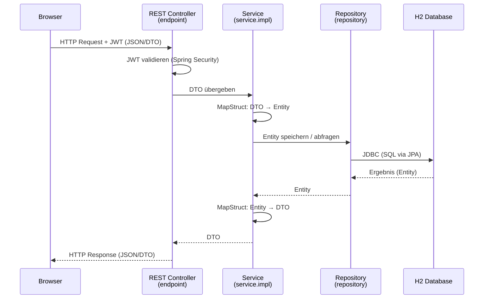

# 5.10 Softwarearchitektur – Ticketline 4.0

---

## 1. Definition des Architekturstils

Ticketline 4.0 verwendet eine **Drei-Schicht-Webanwendung** (3-Tier Web Application) kombiniert mit einer **Layered Architecture** auf der Serverseite.

**Physische Topologie (3-Tier):**

| Tier | Komponente | Laufzeitumgebung |
|------|------------|-----------------|
| Präsentations-Tier | Angular 21 SPA | Browser (Client) |
| Applikations-Tier | Spring Boot 4.0 | JVM (Server) |
| Daten-Tier | H2 Database 2.4.x | JVM (Server, co-located) |

**Logische Schichtenarchitektur (4 Schichten im Backend):**

Die Applikation ist intern in vier logische Schichten gegliedert, die strikt von oben nach unten kommunizieren. Keine Schicht darf übersprungen werden.

```
UI (Browser) → REST API → Business Logic → Persistence → Datenbank
```

---

## 2. Strukturierung der Applikation

### 2.1 Vertikale Strukturierung (Layer)



| Schicht | Verantwortung | Spring-Annotationen |
|---------|--------------|---------------------|
| **UI** | Darstellung, Formularvalidierung, Token-Management | – (Angular) |
| **REST API** | HTTP-Routing, Request-Validierung, Swagger-Doku | `@RestController`, `@RequestMapping` |
| **Service** | Fachliche Regeln, Transaktionen, Berechtigungen | `@Service`, `@Transactional` |
| **Persistenz** | CRUD-Operationen, Datenbankabfragen | `@Repository`, `JpaRepository` |

**Datentransfer zwischen Schichten:**
- **DTO (Data Transfer Object):** Transport zwischen UI und REST-API (kein direktes Entity-Exposure)
- **Entity:** Repräsentation der Datenbankzeilen, wird nur innerhalb des Backends verwendet
- **MapStruct:** Automatisiertes, typsicheres Mapping zwischen DTO <-> Entity zur Compile-Zeit

### 2.2 Horizontale Strukturierung (Module)

Die Applikation gliedert sich in folgende fachliche Module:

| Modul | Beschreibung | Basis / Erweitert | Betroffene User Stories |
|-------|--------------|-------------------|-------------------------|
| Authentifizierung & Sicherheit | Login, Logout, Account-Sperre | Basis | 2.1.2 |
| Benutzerverwaltung | Registrierung, Profil, Admin: Nutzer anlegen/sperren, Passwort zurücksetzen | Basis + **Erweitert 2.2.2** | 2.1.1, 2.1.4, 2.2.2 |
| News | Erstellen, Anzeigen, Detailansicht | Basis | 2.1.3 |
| Veranstaltungen | Suche nach Künstler/Ort/Veranstaltung/Zeit, Top 10 | Basis | 2.1.5 |
| Tickets | Saalplan, Kauf, Reservierung, Stornierung | Basis | 2.1.6 |
| Rechnungsdruck | PDF-Rechnung, PDF-Stornorechnung | Basis | 2.1.7 |
| Merchandise & Prämien | Artikel kaufen, Prämienübersicht, Punkte sammeln & einlösen | **Erweitert 2.2.1** | 2.2.1 |

### 2.3 Backend Package-Struktur (Layer-Slicing)

Das Basis-Package lautet `at.ac.tuwien.sepr.groupphase.backend` und gliedert sich in folgende Sub-Packages:

- **`endpoint/`**: REST Controller (Präsentationsschicht)
  - **`dto/`**: Data Transfer Objects
- **`service/`**: Service-Interfaces (Business-Logik)
  - **`impl/`**: Service-Implementierungen (`@Service`)
  - **`mapper/`**: MapStruct Mapper Interfaces
- **`entity/`**: JPA Entities (Domänenmodell)
- **`dto/`**: Data Transfer Objects
- **`repository/`**: JPA Repositories (`@Repository`)
- **`security/`**: JWT-Konfiguration, Spring Security
- **`configuration/`**: Spring `@Configuration` Klassen
- **`exception/`**: Custom Exception-Klassen
- **`datagenerator/`**: Testdaten-Generator (Profil: `generateData`)

---

## 3. Komponenten- und Verteilungsdiagramm

### 3.1 Komponentendiagramm



### 3.2 Verteilungsdiagramm



---

## 4. Eingesetzte Technologien

### 4.1 Backend

| Kategorie | Technologie | Version |
|-----------|------------|---------|
| Programmiersprache | Java (OpenJDK) | 25 |
| Application Framework | Spring Boot | 4.0.5 |
| Web-Schicht | Spring MVC | (mit Spring Boot) |
| Persistenz (ORM) | Spring Data JPA + Hibernate | (mit Spring Boot) |
| Application Server | Apache Tomcat (Embedded) | (mit Spring Boot) |
| DTO-Mapping | MapStruct | 1.6.3 |
| API-Dokumentation | OpenAPI 3.0 / Swagger UI | (mit Spring Boot) |
| Authentifizierung | JSON Web Token (JWT) | – |
| Build-Tool | Apache Maven | 3 |
| Test-Framework | JUnit | Durch spring-boot-starter-test eingebunden|
| Assertion-Bibliothek | AssertJ | spring-boot-starter-test eingebunden |

### 4.2 Frontend

| Kategorie | Technologie | Version |
|-----------|------------|---------|
| Frontend-Framework | Angular | 21 |
| Programmiersprache | TypeScript | (mit Angular) |
| JavaScript-Runtime | Node.js | 24.14.0 LTS |
| Package-Manager | npm | 11.9.0 |

### 4.3 Infrastruktur & DevOps

| Kategorie | Technologie | Version |
|-----------|------------|---------|
| Versionskontrolle | Git | 2.x |
| CI/CD | GitLab CI | – |
| Containerisierung | Docker | – |
| Orchestrierung | Kubernetes | – (TU-betrieben) |
| IDE | IntelliJ IDEA | Community / Ultimate |

---

## 5. Datenhaltung

### 5.1 Datenbanksystem

Es wird eine **relationale Datenbank** eingesetzt: **H2 Database (Version 2.4.x)**.

| Eigenschaft | Wert |
|-------------|------|
| Datenbanktyp | Relationale SQL-Datenbank |
| Betriebsmodus | File-based (Automatic Mixed Mode) |
| Speicherort | `./database/db` (relativ zum Backend-Verzeichnis) |
| Verbindungsprotokoll | JDBC (Java Database Connectivity) |
| JDBC-Connection-String | `jdbc:h2:file:<absoluterPfad>/database/db` |
| Zugangsdaten | Username: `admin`, Passwort: `password` |

H2 im Automatic Mixed Mode erlaubt parallele Zugriffe durch das Backend (über JDBC) und durch externe Tools (IntelliJ IDEA, DataGrip) gleichzeitig.

### 5.2 Datenzugriff (Repository Pattern)

Der Zugriff auf die Datenbank erfolgt ausschließlich über das **Repository Pattern** mittels Spring Data JPA:

- **Einfache CRUD-Operationen:** werden automatisch durch `JpaRepository<Entity, ID>` bereitgestellt
- **Komplexe Abfragen:** werden via JPQL mit `@Query`-Annotation oder der JPA Criteria API definiert
- **Transaktionen:** werden durch `@Transactional` auf Service-Ebene gesteuert

### 5.3 Datenbankschema-Verwaltung

Das Datenbankschema wird beim Start der Applikation durch **Hibernate automatisch** aktualisiert (`spring.jpa.hibernate.ddl-auto`). Bei nicht lösbaren Schemakonflikten wird das Datenbankverzeichnis (`./database/`) manuell gelöscht und beim nächsten Start neu erstellt.

### 5.4 Datenflussbeschreibung



---
